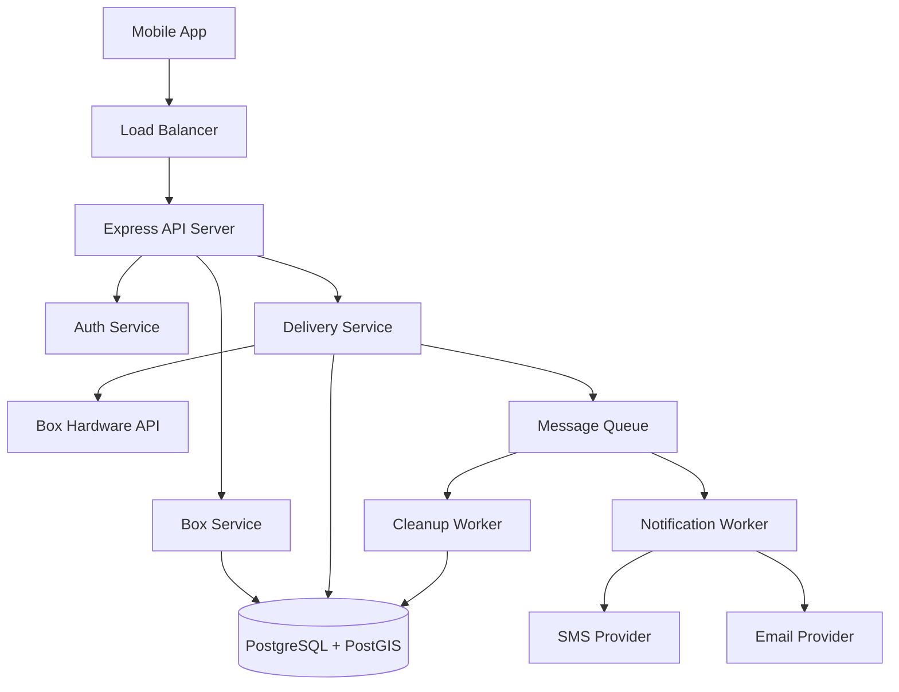
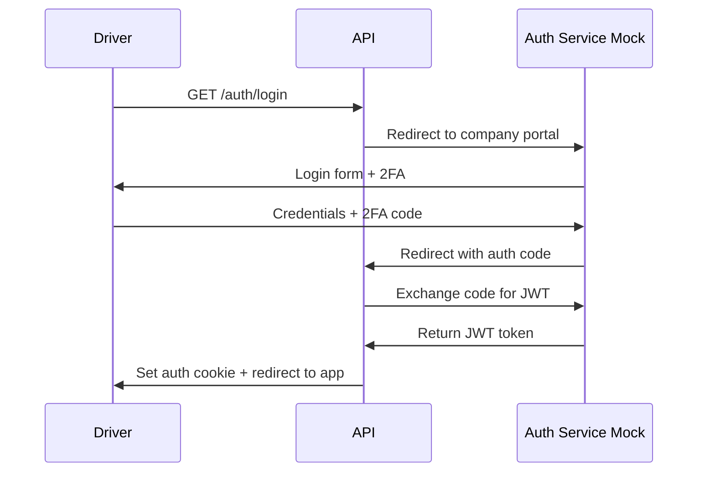
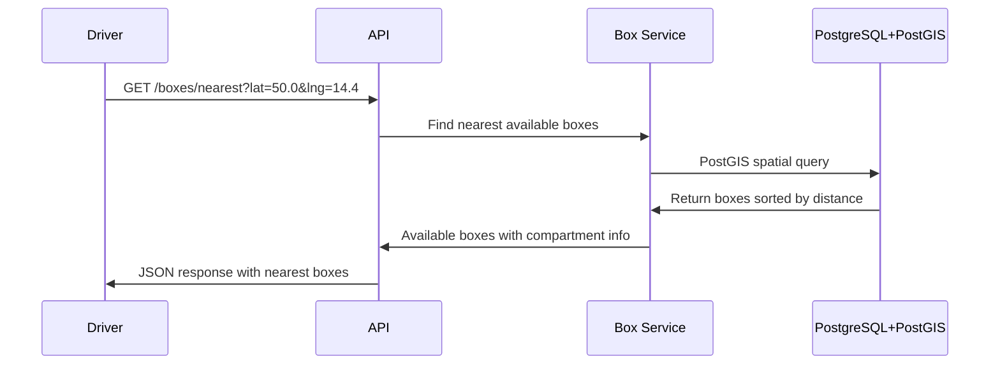
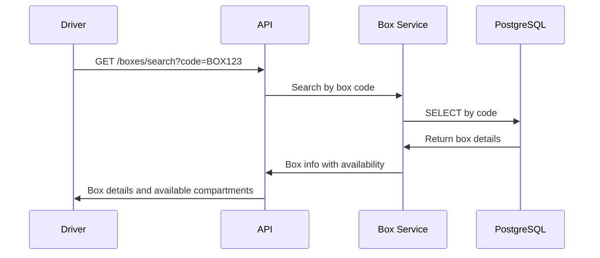
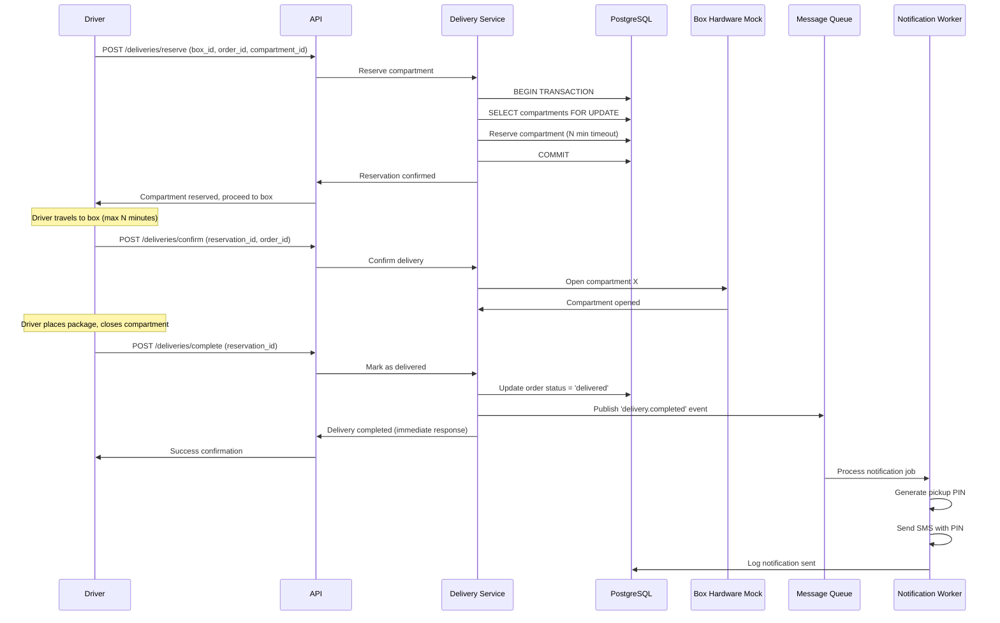

# Task 1. - Box Delivery Analysis
## Goal
Design an API for box delivery application covering the complete delivery workflow. There are two types of users - regular user and delivery person (driver). Drivers deliver packages to boxes and users pick them up. The daily load is 100K deliveries and multiple drivers delivering packages.

## 1a. Risk and Problems

### Specification Ambiguities
**Issue:** Use case suggests delivery drivers dynamically select nearby pickup boxes, but standard logistics involves pre-assigned delivery points for optimal routing.
**Solution:** Assume we build a system where drivers can select from available nearby boxes when original assignment is unavailable or for overflow situations. Also assume drivers have a list of orders with assigned box codes but can reassign if needed.

### Physical Box Integration
**Issue:** No specification of API for communication with physical boxes to open/close compartments, monitor status, detect hardware failures.
**Solution:** Assume there is an external provider API for box hardware communication.

### Concurrent Box Access
**Issue:** Multiple drivers may be routed to the same nearby box with limited compartments, leading to race conditions.
**Solution:** Introduce compartment reservation system with predefined timeout. Drivers reserve compartments before driving to the box.

### Package Size and Compartment Fit
**Issue:** Task doesn't mention if box search should return only boxes with free compartments that can fit the package.
**Solution:** Assume compartments have standard sizes (S, M, L, XL, XXL). Driver selects appropriate compartment size when reserving.

### Authentication and Security
**Issue:** Use case mentions company login portal and 2FA but no details on implementation.
**Solution:** Mock OAuth2-style authentication flow. Assume external identity provider handles authentication, our system receives JWT tokens.

### Scale Requirements and Over-Engineering Risk
**Issue:** 100K daily orders (~1.15/sec average, ~20/sec peak) doesn't require complex distributed architecture initially, but system should scale when needed.
**Solution:** 
- **Phase 1 (Current Load):** Single server with PostgreSQL + PostGIS handles this easily
- **Phase 2 (10x Growth):** Add Redis caching, connection pooling
- **Phase 3 (100x Growth):** Add DB read replicas

## 1b. Architecture Design



## Core Components:

### API Layer
**Express.js Server** - Handles HTTP requests, authentication, validation, error handling
- Single instance initially (horizontal scaling behind load balancer in Phase 2)
- JWT-based authentication with role-based access control
- Structured error responses

### Box Service
**Purpose:** Handle all box-related operations - finding, availability, compartment management
- PostGIS geospatial queries with spatial indexes
- Box status and compartment availability tracking
- Search by location radius or box code

### Delivery Service  
**Purpose:** Handle delivery workflow - reservations, confirmations, order tracking
- Compartment reservation with timeout mechanism (10 minutes)
- Atomic operations to prevent race conditions
- Integration with box hardware for compartment control
- Order status management

### Message Queue & Workers
**Purpose:** Handle async operations that shouldn't block API responses
- **Message Queue** for job processing
- **Notification Worker:** SMS/email delivery, retry logic, failure handling
- **Cleanup Worker:** Expired reservation cleanup
- **Dead Letter Queue:** Failed job handling and alerting

### Auth Service
**Purpose:** Handle user authentication and authorization
- OAuth2 flow with external identity provider
- JWT token validation
- Role-based permissions (driver, user)

## Complete Use Case Flows

### 1. Driver Authentication


### 2. Find Nearest Boxes


### 3. Box Search by Code


### 4. Package Delivery Workflow


## Database Schema

```sql
-- Boxes table
CREATE TABLE boxes (
    id SERIAL PRIMARY KEY,
    code VARCHAR(50) UNIQUE NOT NULL,
    name VARCHAR(255) NOT NULL,
    address TEXT NOT NULL,
    location GEOMETRY(POINT, 4326) NOT NULL,
    status VARCHAR(20) DEFAULT 'active',
    total_compartments INTEGER DEFAULT 10,
    available_compartments INTEGER DEFAULT 10,
    created_at TIMESTAMP DEFAULT CURRENT_TIMESTAMP,
    updated_at TIMESTAMP DEFAULT CURRENT_TIMESTAMP
);

-- Compartments table
CREATE TABLE compartments (
    id SERIAL PRIMARY KEY,
    box_id INTEGER REFERENCES boxes(id),
    compartment_number INTEGER NOT NULL,
    size VARCHAR(10) NOT NULL, -- S, M, L, XL, XXL
    status VARCHAR(20) DEFAULT 'available', -- available, reserved, occupied
    created_at TIMESTAMP DEFAULT CURRENT_TIMESTAMP,
    updated_at TIMESTAMP DEFAULT CURRENT_TIMESTAMP
);

-- Orders table (simplified - external system manages full order data)
CREATE TABLE orders (
    id SERIAL PRIMARY KEY,
    external_order_id VARCHAR(100) UNIQUE NOT NULL,
    customer_id VARCHAR(100) NOT NULL,
    status VARCHAR(50) DEFAULT 'pending', -- pending, in_transit, delivered, picked_up
    pickup_pin VARCHAR(10),
    created_at TIMESTAMP DEFAULT CURRENT_TIMESTAMP,
    updated_at TIMESTAMP DEFAULT CURRENT_TIMESTAMP
);

-- Reservations table - contains information about reserved compartments
CREATE TABLE compartment_reservations (
    id SERIAL PRIMARY KEY,
    compartment_id INTEGER REFERENCES compartments(id),
    order_id INTEGER REFERENCES orders(id),
    driver_id VARCHAR(100) NOT NULL,
    status VARCHAR(20) DEFAULT 'active', -- active, expired, completed
    expires_at TIMESTAMP NOT NULL,
    created_at TIMESTAMP DEFAULT CURRENT_TIMESTAMP
);

-- Deliveries table
CREATE TABLE deliveries (
    id SERIAL PRIMARY KEY,
    reservation_id INTEGER REFERENCES reservations(id),
    order_id INTEGER REFERENCES orders(id),
    delivered_at TIMESTAMP DEFAULT CURRENT_TIMESTAMP,
    picked_up_at TIMESTAMP NULL
);

-- Indexes
CREATE INDEX idx_boxes_location ON boxes USING GIST (location);
CREATE INDEX idx_boxes_status ON boxes (status);
CREATE INDEX idx_compartments_box_status ON compartments (box_id, status);
CREATE INDEX idx_reservations_expires ON reservations (expires_at);
CREATE INDEX idx_orders_status ON orders (status);
```

## API Endpoints (Full System)

### Authentication
- `GET /auth/login` - Initiate OAuth flow
- `GET /auth/callback` - Handle OAuth callback
- `POST /auth/logout` - Logout user

### Box Management
- `GET /boxes/nearest?lat&lng&radius` - Find nearest boxes *(Primary Implementation)*
- `GET /boxes/search?code` - Search box by code
- `GET /boxes/:id` - Get box details
- `GET /boxes/:id/compartments` - Get available compartments

### Delivery Workflow
- `POST /deliveries/reserve` - Reserve compartment
- `POST /deliveries/confirm` - Confirm delivery and open compartment
- `POST /deliveries/complete` - Complete delivery
- `GET /deliveries/:id/status` - Check delivery status
