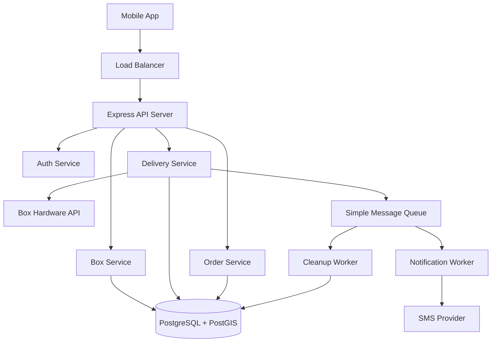
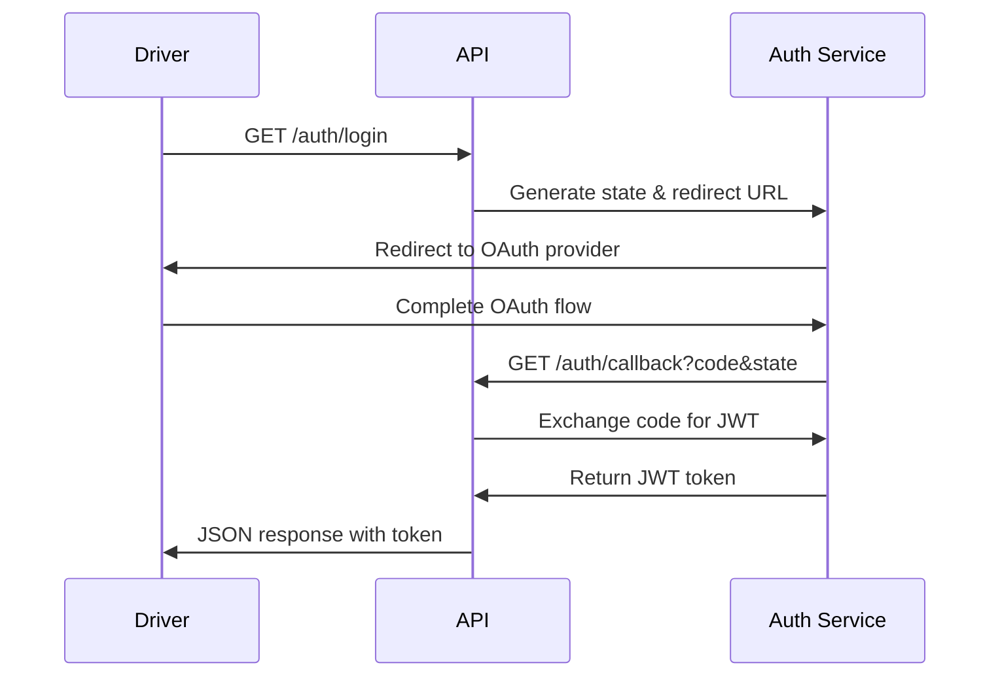
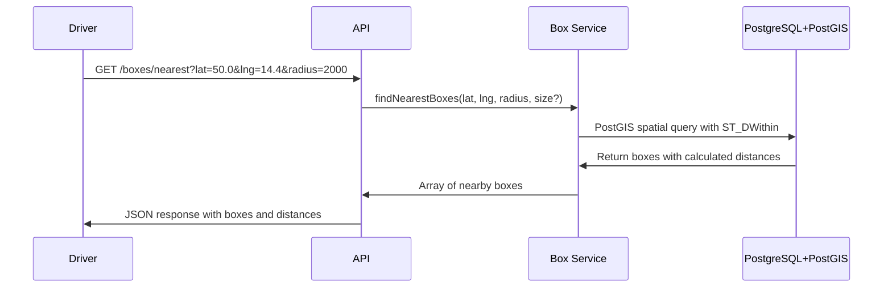
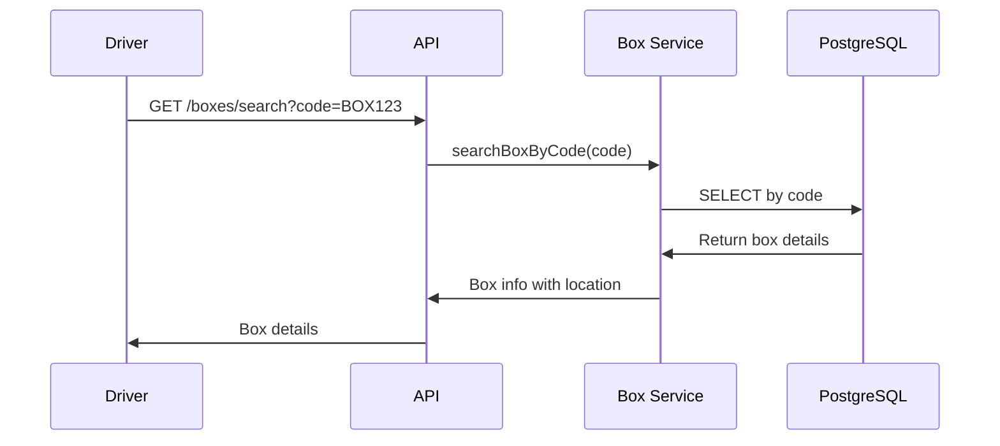
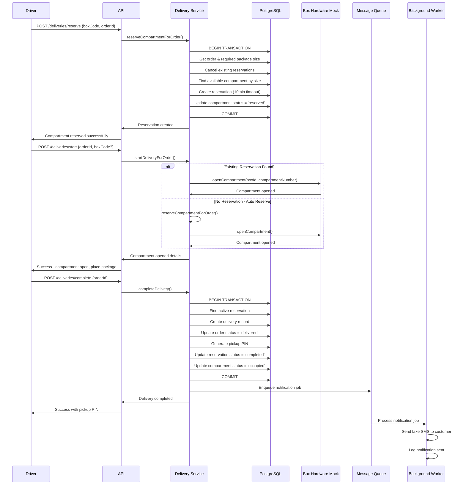

# Task 1. - Box Delivery Analysis
## Goal
Design an API for box delivery application covering the complete delivery workflow. There are two types of users - regular user and delivery person (driver). Drivers deliver packages to boxes and users pick them up. The daily load is 100K deliveries and multiple drivers delivering packages.

## 1a. Risk and Problems

### Specification Ambiguities
**Issue:** Use case suggests delivery drivers dynamically select nearby pickup boxes, but standard logistics involves pre-assigned delivery points for optimal routing.
**Solution:** Assume we build a system where drivers can select from available nearby boxes when original assignment is unavailable or for overflow situations. Also assume drivers have a list of orders with assigned box codes but can reassign if needed.

### Physical Box Integration
**Issue:** No specification of API for communication with physical boxes to open/close compartments, monitor status, detect hardware failures.
**Solution:** Assume there is an external provider API for box hardware communication.

### Concurrent Box Access
**Issue:** Multiple drivers may be routed to the same nearby box with limited compartments, leading to race conditions.
**Solution:** Introduce compartment reservation system with predefined timeout. Drivers reserve compartments before driving to the box.

### Package Size and Compartment Fit
**Issue:** Task doesn't mention if box search should return only boxes with free compartments that can fit the package.
**Solution:** Assume compartments have standard sizes (S, M, L, XL, XXL). Driver selects appropriate compartment size when reserving.

### Authentication and Security
**Issue:** Use case mentions company login portal and 2FA but no details on implementation.
**Solution:** Mock OAuth2-style authentication flow. Assume external identity provider handles authentication, our system receives JWT tokens.

### Scale Requirements and Over-Engineering Risk
**Issue:** 100K daily orders (~1.15/sec average, ~20/sec peak) doesn't require complex distributed architecture initially, but system should scale when needed.
**Solution:** 
- **Phase 1 (Current Load):** Single server with PostgreSQL + PostGIS handles this easily
- **Phase 2 (10x Growth):** Add Redis caching, connection pooling
- **Phase 3 (100x Growth):** Add DB read replicas

## 1b. Architecture Design



## Core Components:

### API Layer
**Express.js Server** - Handles HTTP requests, authentication, validation, error handling
- JWT-based authentication with role-based access control
- Structured error responses with custom error classes
- Swagger documentation at `/api-docs`

### Box Service
**Purpose:** Handle all box-related operations - finding, availability, compartment management
- PostGIS geospatial queries for nearest box search
- Box search by code functionality
- Compartment availability checking with size filtering

### Delivery Service  
**Purpose:** Handle delivery workflow - reservations, delivery start/completion
- Compartment reservation with timeout mechanism
- Smart delivery start (auto-reserves if no existing reservation)
- Atomic delivery completion with PIN generation
- Integration with message queue for notifications

### Order Service
**Purpose:** Handle order listing and status management
- Order listing with optional status filtering
- Order status updates
- Validation of order states and transitions

### Message Queue & Workers (Demo Implementation)
**Purpose:** Handle async operations without blocking API responses
- **Simple In-Memory Queue** for job processing (demo only)
- **Notification Worker:** Fake SMS notifications for customer pickup PINs
- **Cleanup Worker:** Expired reservation cleanup every N minutes
- Background processing with job status tracking

### Auth Service
**Purpose:** Handle user authentication and authorization
- OAuth2 flow with external identity provider
- JWT token validation and user context
- Mock SSO implementation for testing

## Complete Use Case Flows (As Implemented)

### 1. Driver Authentication


### 2. Find Nearest Boxes


### 3. Box Search by Code


### 4. Complete Package Delivery Workflow


## Database Schema (As Implemented)

```sql
-- Boxes table with PostGIS geography
CREATE TABLE "Box" (
    id TEXT PRIMARY KEY,
    code TEXT UNIQUE NOT NULL,
    name TEXT NOT NULL,
    address TEXT NOT NULL,
    location geography(Point,4326) NOT NULL,
    status TEXT DEFAULT 'active',
    total_compartments INTEGER DEFAULT 10,
    available_compartments INTEGER DEFAULT 10,
    created_at TIMESTAMP DEFAULT CURRENT_TIMESTAMP,
    updated_at TIMESTAMP DEFAULT CURRENT_TIMESTAMP
);

-- Compartments table
CREATE TABLE compartments (
    id SERIAL PRIMARY KEY,
    box_id TEXT REFERENCES "Box"(id),
    compartment_number INTEGER NOT NULL,
    size TEXT NOT NULL, -- S, M, L, XL, XXL
    status TEXT DEFAULT 'available', -- available, reserved, occupied
    created_at TIMESTAMP DEFAULT CURRENT_TIMESTAMP,
    updated_at TIMESTAMP DEFAULT CURRENT_TIMESTAMP,
    UNIQUE(box_id, compartment_number)
);

-- Orders table
CREATE TABLE orders (
    id SERIAL PRIMARY KEY,
    external_order_id TEXT UNIQUE NOT NULL,
    customer_id TEXT NOT NULL,
    status TEXT DEFAULT 'pending', -- pending, delivered, picked_up
    pickup_pin TEXT,
    package_size TEXT DEFAULT 'M', -- S, M, L, XL, XXL
    created_at TIMESTAMP DEFAULT CURRENT_TIMESTAMP,
    updated_at TIMESTAMP DEFAULT CURRENT_TIMESTAMP
);

-- Reservations table
CREATE TABLE compartment_reservations (
    id SERIAL PRIMARY KEY,
    compartment_id INTEGER REFERENCES compartments(id),
    order_id INTEGER REFERENCES orders(id),
    driver_id TEXT NOT NULL,
    status TEXT DEFAULT 'active', -- active, expired, completed
    expires_at TIMESTAMP NOT NULL,
    created_at TIMESTAMP DEFAULT CURRENT_TIMESTAMP,
    UNIQUE(order_id, status) -- Only one active reservation per order
);

-- Deliveries table
CREATE TABLE deliveries (
    id SERIAL PRIMARY KEY,
    reservation_id INTEGER REFERENCES compartment_reservations(id),
    order_id INTEGER REFERENCES orders(id),
    delivered_at TIMESTAMP DEFAULT CURRENT_TIMESTAMP,
    picked_up_at TIMESTAMP NULL
);

-- Indexes
CREATE INDEX idx_boxes_location ON boxes USING GIST (location);
CREATE INDEX idx_boxes_status ON boxes (status);
CREATE INDEX idx_compartments_box_status ON compartments (box_id, status);
CREATE INDEX idx_reservations_expires ON reservations (expires_at);
CREATE INDEX idx_orders_status ON orders (status);
```

## API Endpoints (Full System)

### Authentication
- `GET /auth/login` - Initiate OAuth flow with state parameter
- `GET /auth/callback` - Handle OAuth callback and token exchange

### Box Management
- `GET /boxes/nearest?lat&lng&radius&size` - Find nearest boxes with PostGIS
- `GET /boxes/search?code` - Search box by code
- `GET /boxes/:boxCode/compartments` - Get available compartments for box

### Delivery Workflow
- `POST /deliveries/reserve` - Reserve compartment for order
- `POST /deliveries/start` - Start delivery (opens compartment, auto-reserves if needed)
- `POST /deliveries/complete` - Complete delivery and generate pickup PIN
- `POST /deliveries/test-notification` - Test notification system (dev only)

### Order Management
- `GET /orders?status` - List orders with optional status filter
- `PATCH /orders/:id/status` - Update order status

### Mock SSO (Testing Only)
- `GET /mock-sso/login` - Mock login form
- `POST /mock-sso/token` - Mock token exchange
- `POST /mock-sso/test-token` - Generate test JWT directly

## Key Implementation Features

### Geospatial Search
- Uses PostGIS `ST_DWithin` for efficient radius-based box search
- Spatial indexes for sub-second query performance
- Distance calculation with `ST_Distance` for result ordering

### Smart Delivery Flow
- **Two-step process**: Reserve → Start → Complete
- **Auto-reservation**: `/deliveries/start` can auto-reserve if no existing reservation
- **Conflict prevention**: Atomic transactions prevent race conditions
- **Timeout handling**: Reservations expire automatically after N minutes

### Background Processing
- **Simple in-memory queue** for Phase 1 (production would use Redis/RabbitMQ)
- **Async notifications**: SMS notifications don't block API responses
- **Auto-cleanup**: Expired reservations cleaned up every 2 seconds
- **Job tracking**: Queue statistics and processing status

### Error Handling
- **Custom error classes**: ValidationError, NotFoundError, ConflictError
- **Structured responses**: Consistent error format across all endpoints
- **Transaction safety**: Database operations wrapped in transactions

### Security & Validation
- **JWT authentication**: Role-based access control (driver role required)
- **CSRF protection**: OAuth state parameter validation
- **Input validation**: Comprehensive parameter and request body validation
- **Size validation**: Package size matching with compartment availability

## Performance Considerations

### Current Scale (100K orders/day)
- **Single PostgreSQL instance** handles load easily
- **PostGIS spatial indexes** provide sub-second box searches

### Future Scaling (10x+ Growth)
- **Database**: Add read replicas for box searches
- **Queue**: Migrate to dedicated Message broker with multiple workers
- **Caching**: Add Redis for frequently accessed box data
- **Load balancing**: Multiple API server instances
